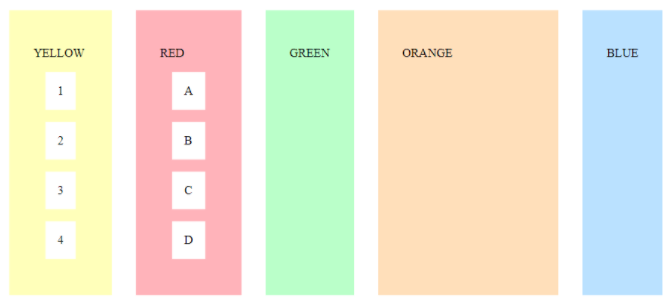
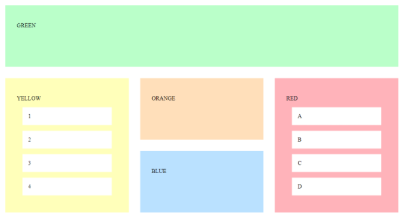
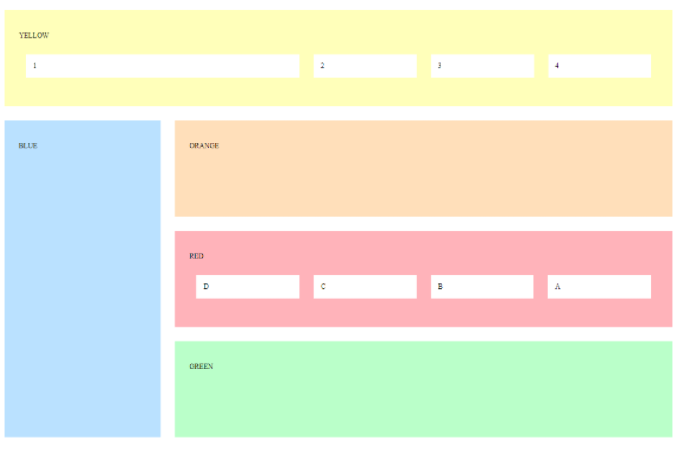
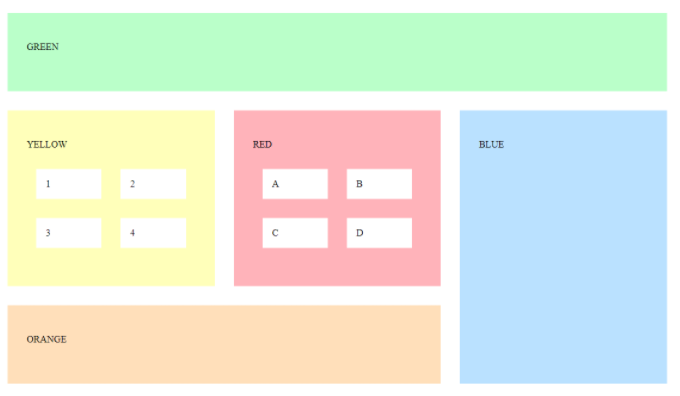

# Grid/Flex - Exercise 1

Use CSS grid/flex to change the output to match the screen capture below.

# Grid/Flex - Exercise 2

Use CSS grid/flex to change the output to match the screen capture below.

# Grid/Flex - Exercise 3

Use CSS grid/flex to change the output to match the screen capture below.

# Grid/Flex - Exercise 4

Use CSS grid/flex to change the output to match the screen capture below.

